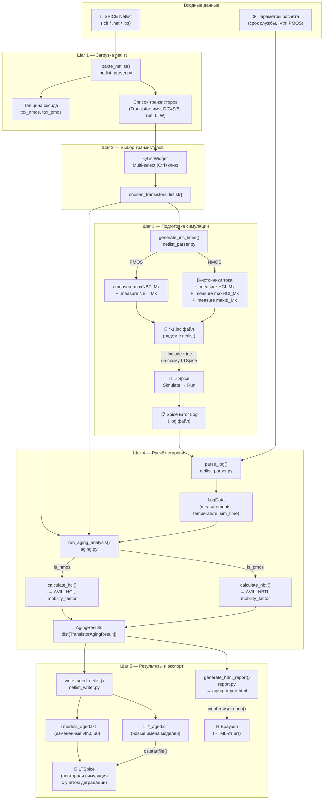
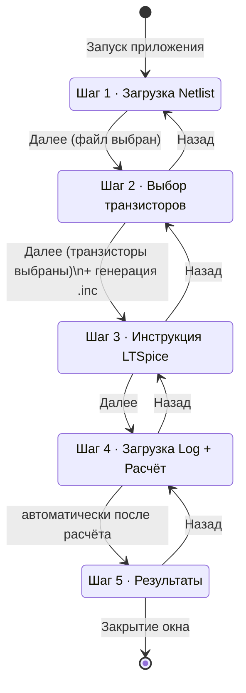
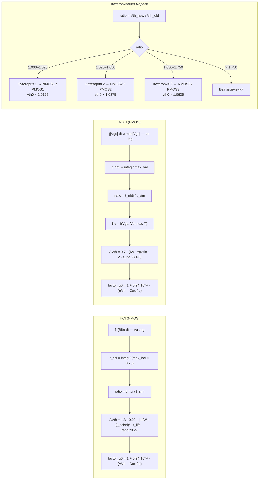

# Схема работы MOS Aging Analyzer

## Общий поток (Mermaid)

---

## Интерфейс — навигация по шагам

---

## Физические расчёты

---

## Точки экспорта

| Файл | Когда создаётся | Формат |
|---|---|---|
| `*-1.inc` | Шаг 2→3 (generate_inc_lines) | Текст SPICE |
| `aging_report.html` | Автоматически после расчёта | HTML |
| `*_aged.cir` | По кнопке «Создать постаревший netlist» | SPICE netlist |
| `models_aged.txt` | Вместе с `_aged.cir` | SPICE .model |

> **Примечание по кнопке «Далее»:**  
> На шаге 4 кнопка «Далее» видна, но при нажатии ничего не происходит  
> (`elif step == 3: return` в `_go_next()`). Переход на шаг 5 происходит  
> автоматически после успешного расчёта через `_on_analysis_done()`.  
> Это является UX-проблемой — кнопка должна быть скрыта на этом шаге.
